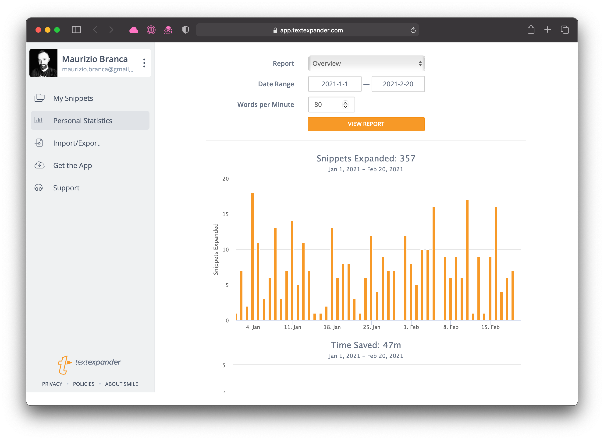
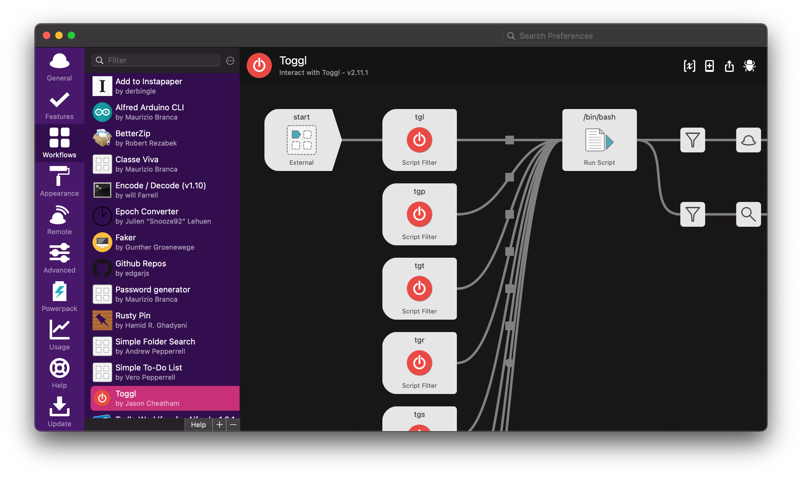
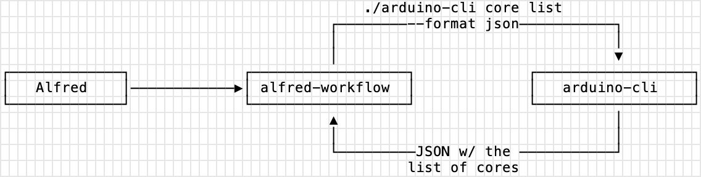

 ## Automate all the things
 
### A story about friction and wasted time.

There are a lot of big and small tasks we perform on our computers every day. Even when if they are simple, sometimes they carry a small amount of friction and always require some time. If you just do them once, there is no big deal. But, often we do them over and over agin, day in and day out, so their cumulative cost adds up into a not trivial amount.

### 🤨 I'm pretty skeptical, please give something more tangible

I use an app called [TextExpander](https://textexpander.com/) every day to automatically *expand* abbreviation into snipplets of text I often use throughout the day.

For example, when I type:
 * `;me` TextExpander replaces it with my full name "Maurizio Branca"
 * `;em` with my email address
 * `;pr` with my favourite [template for pull-requests](https://gist.github.com/zmoog/40e989c7e2a4450a4ee5d8b6d2833f04)
 * `;shrug` with `¯\_(ツ)_/¯`


### Numbers

According to TextExpander, since January 1st I saved **47 minutes** just expanding abbreviations into text instead of typing it on my keyboard.



It might or might not feel like a big deal, but actually I saved time AND removed friction from my workflow. Every time a expand a multiple words text or a template, I feel good.

### Numbers

I started with TextExpander because it is kind enough to give me the numbers, but today I want to write about another tool that can save you time and remove friction: Alfred for macOS.


 ## What is Alfred?
 
 ### One application to launch them all

[Alfred](https://www.alfredapp.com) is a desktop [application launcher](https://en.wikipedia.org/wiki/Comparison_of_desktop_application_launchers) for macOS.

There are a good number of launchers for macOS: [LaunchBar](https://www.google.it/search?q=launchbar), the venerable [Quicksilver](https://qsapp.com) and the built in [Spotlight](https://en.wikipedia.org/wiki/Spotlight_(software)) from Apple. But, Alfred is a special one.

### Features

You can use Alfred to launch applications, perform simple calculations, lookup locations using map services, search products on Amazon or anything else on Google more.


If you're willing to [pay £29.00](https://www.alfredapp.com/shop/) you'll get the real value out of it.

The already metioned features can be a really handy and useful tool, but as developers, the real powerful and most interesting stuff comes out of the Powerpack.


### 💰⚡️ The Powerpack

Here's what you get if you purchase the [Alfred Powerpack](https://www.alfredapp.com/powerpack/).

 * **Clipboard history** — you can search and paste again up to three months of text copied in the pastboard (it's how macOS call the clipboard)
 * **Snipplets** — a basic TextExpander built in Alfred
 * **Files**
 * **Contacts** — search end open your contacts, gread for lookup a phone number or an email addres in an instant
 * **Workflows**
 * and more.

 Clipboard history and contacts are truly great, but Workflows are a real game changer.


 ## Workflows

[Workflows](https://www.alfredapp.com/workflows/) are an extentions mechanism that allow third party developers to write their own additional feature that can be pluggein in Afred, triggered and executed from Alfred using a keyword.



Workflows can be written in virtually any language that can write XML, the markup used to communicate between Alfred and the workflow (more on this later).

Today I want to share how to write useful custom workflows using Python.


 ## Introducing Alfred-Workflows

There is probably one framework for every major language out there, but the Python based [Alfred-Workflow](https://github.com/deanishe/alfred-workflow) from [deanishe](https://twitter.com/deanishe) is absolutely one of the best ones.

I created multiple workflow to bot scratch an itch and solve practical problem, and it's been a real fun.

 ## Example: ClasseViva

[ClasseViva](https://web.spaggiari.eu/sdf/app/default/cvv.php?vista=scheda_prodotto) is the electronic class register used by a lot of schools here in Italy. 

I build a small workflow using the library https://github.com/zmoog/classeviva-client to access the grades of my older kid during the week, so I can access the latest one with a very fre keystrokes.


The alternative was open a new browser tab/window, log into the website, select the grades.


 ## Example: Arduino CLI

Sometime I need to peek the details of one of the Arduino boards connected to my laptop, list the installed core or search through the libraties using the Arduino CLI.

I always have a terminal open on my desktop (with zsh, reverse search ready and all the nine yards), but a well prepared launcher can be quicker.

Launcher are great when you have a limited set of recurring actions you repeat every day (or maybe even every hour or fre minutes) you can optimize for.

An Alfred workflow is perfect for this kind of stuff.


### Source code

You can browse the final project visiting https://github.com/zmoog/alfred-arduino-cli/.


### High level overview

When you type the keyword on Afred then it:

1. triggers the workflow
2. the workflow executes the `arduino-cli` setting the output to JSON format
3. when the `arduino-cli` is finished, the workflow parses the output and buid the response and return it to the Alfred core.




The Arduino CLI workflow runs the `arduino-cli.py` file using the Python interpreter with a defined set of commands.

https://www.deanishe.net/alfred-workflow/tutorial_1.html


### How to Create a new Workflow

If you want to start creating your own workflows in Python using Alfred-Workflows, then your best option is to start with the great  [Tutorial Part 1: Creating a Basic Pinboard Workflow](https://www.deanishe.net/alfred-workflow/tutorial_1.html).

This short and focused tutorial explan how to build a simple Pinboard workflow from scratch.


### 1. Trigger the Workflow

I used a script filter to trigger the workflow typing `cli` on Alfred.


When I select one of the actions available, Alfred will run the Python script `python arduino-cli.py core list {query}` for me behind the scene, replacing `{query}` with the text I typed, and the waiting the script to execute and return the response XML.

### 2. The Workflow Executes

The script is a regular Python script you can also run on the terminal to testing and troubleshooting.

```python
def main(wf):
  
    # build argument parser to parse script args and collect their
    # values
    parser = argparse.ArgumentParser()

    # add a required command and save it to 'command'
    parser.add_argument('command') 
    # add a required sub command and save it to 'sub_command'
    parser.add_argument('subcommand', nargs='?', default='none')
    # add an optional query and save it to 'query'
    parser.add_argument('query', nargs='?', default=None)

    # parse the script's arguments
    args = parser.parse_args(wf.args)

    Handler(args, wf).run()


if __name__ == u"__main__":
    wf = Workflow(libraries=["./libs"])
    log = wf.logger
    sys.exit(wf.run(main))

```

The Alfred-Workflow library does the heavy duty of offering a nice API do produce the XML Alfred requires to work with workflows, and a lot of useful goodies, for example.

 * Fuzzy, Alfred-like search/filtering with diacritic folding
 * Simple, persistent settings
 * Simple, auto-expiring data caching
 * Keychain support for secure storage (and syncing) of passwords, API keys etc.
 * Lightweight web API with requests-like interface

and more, check out the [full list of features](https://www.deanishe.net/alfred-workflow/index.html#features).

### 3. Run the actual arduin-cli binary and parse the output

The real work is performed by the [Arduino CLI](https://github.com/arduino/arduino-cli).

Here I am using [Invoke](http://www.pyinvoke.org/installing.html) to run the binary, collect and parse the JSON returned in the standard output.

#### Invoke

To keep the workflow as simple as possible I used the `--format json` available for most of the CLI commands. The result is returned as a nice JSON that can be easily parsed using the builtin `json` module.

```python
def run_command(cmd):
    from invoke import run
    
    cmd = "./arduino-cli {cmd} --format json".format(cmd=cmd)

    result = run(cmd, hide=True, warn=True)
    if not result.ok:
        raise Exception(result.stdout)

    return json.loads(result.stdout)
```

#### Build a response for Alfred

This the JSON response parse into a Python dictionary, all I need to to is build the items for Alfred.

```python
    def handle_version_none(self):
        
        version = run_command("version")

        self.wf.add_item(title=version["VersionString"],
                         subtitle='version')
        self.wf.add_item(title=version["Commit"],
                         subtitle='Commit')
        self.wf.add_item(title=version["Status"],
                         subtitle='Status')

        
        # Send the results to Alfred as XML
        self.wf.send_feedback()
```

And finally, when the Python script is done, this is what Alfred get back:

```xml
<?xml version="1.0" encoding="utf-8"?>
<items>
    <item valid="no">
        <title>0.16.0</title>
        <subtitle>version</subtitle>
    </item>
    <item valid="no">
        <title>c977a2382c2e7770b3eedc43e6a9d41f4a6c3483</title>
        <subtitle>Commit</subtitle>
    </item>
    <item valid="no">
        <title>alpha</title>
        <subtitle>Status</subtitle>
    </item>
</items>%  
```


 ## Conclusion

[Is it worth the time](https://xkcd.com/1205/)? Yep! 

Start small with something you need to "fix", like removing the friction of opening a site 1-3 times a day to check and information, generate am UUID on the fly or a password with just three keystrokes.

## Music
This post has been written listening to [Black Market](https://open.spotify.com/album/4COZn5okauxP5luXkwEPLd?si=6aSBpgopSNCpm8w9OgGy6w) by [Weather Report](https://open.spotify.com/artist/162DCkd8aDKwvjBb74Gu8b?si=6Ybw6IUlQbuLfxD1M6d2Tw).
